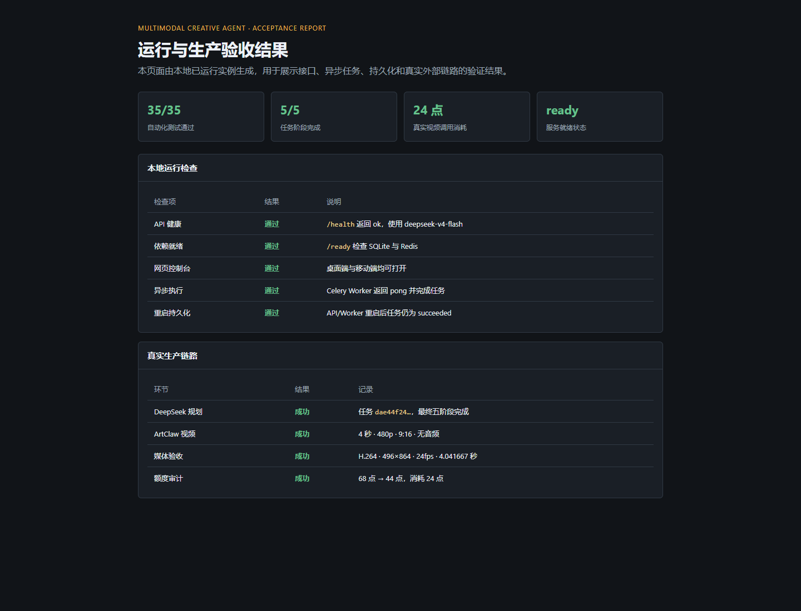
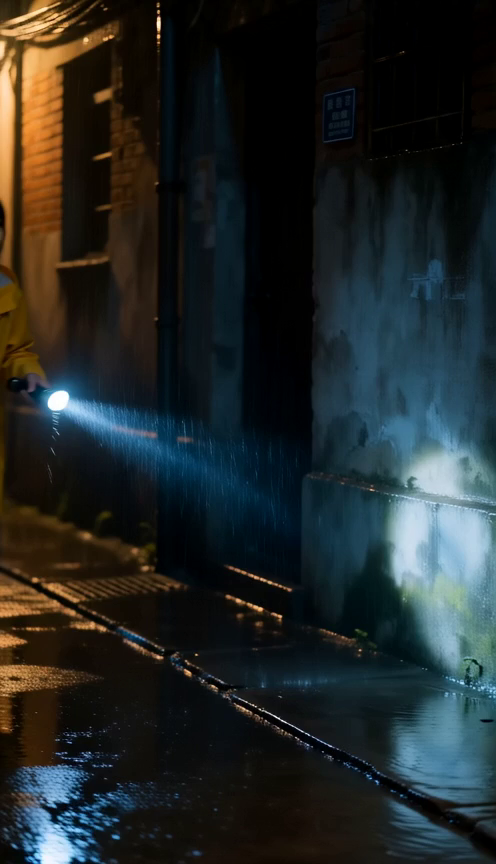

<div align="center">

# MultimodalCreativeAgent

### AI 多模态创作与短剧生成 Agent 平台

[](02_Source/requirements-optional.txt)
[](https://github.com/baiqijun233/MultimodalCreativeAgent/actions/workflows/tests.yml)
[](02_Source/docker-compose.yml)
[](06_Tests/test_short_drama_agent.py)
[](LICENSE)

**需求输入 → 结构化分镜 → 异步执行 → 可审计交付**

</div>

> 一个可以独立启动、失败可恢复、付费调用有明确保护的多模态创作任务平台。

<details>
<summary>📌 快速导航</summary>

[项目预览](#项目预览) · [快速开始](#快速开始) · [配置](#配置) · [接口](#常用接口) · [测试与验证](#测试与验证) · [路线图](#当前边界与路线图)

</details>

面向短剧和多模态创作任务的轻量级 Agent 平台。它把自然语言需求拆成可校验的角色、场景和分镜计划，再通过异步任务、持久化状态和外部模型适配器完成后续执行。

项目重点不是“把所有模型都塞进流程”，而是提供一条可恢复、可审计、可独立运行的创作任务链路：模型输出不合格会被拦截，付费调用默认需要显式确认，任务失败后可以从已完成阶段继续。

## ✨ 项目预览

### 网页控制台

桌面宽度下可创建任务、查看状态、查看资产并预览过期任务清理。


移动宽度下自动收起次要表格列，保留状态、需求和核心操作。


### 验收结果





真实生产验收视频：[formal_production_artclaw_5245e956.mp4](08_Deliverables/formal_production_artclaw_5245e956.mp4)

## 🚀 能做什么

- 需求分析、角色/场景/分镜规划和结构化一致性校验
- DeepSeek 真实规划，缺少密钥时自动回退离线模型
- ArtClaw 视频任务提交、状态轮询、批量提交和下载
- 可选图片资产生成，支持分批、幂等和失败续跑
- SQLite 任务状态持久化，Redis 状态缓存和事件总线
- Celery 异步 Worker、WebSocket 任务事件推送
- Redis 跨进程付费提交锁，避免多实例重复提交
- SQLite 额度审计与 `/metrics` 基础指标
- 网页控制台、任务列表、安全清理和资产路径隔离

## 🧩 运行架构

```text
需求输入
   ↓
FastAPI / 网页控制台
   ↓
Celery Worker ── Redis（队列、状态、事件、分布式锁）
   ↓
分析 → 规划 → 校验 → 资产任务 → 汇总
   ↓
SQLite + /data 持久化资产
   ↓
DeepSeek / ArtClaw / 可选图片服务
```

## ⚡ 快速开始

### Docker（推荐）

```powershell
docker compose -f 02_Source\docker-compose.yml up -d --build
```

访问：

- 网页控制台：http://127.0.0.1:8001/
- 健康检查：http://127.0.0.1:8001/health
- 就绪检查：http://127.0.0.1:8001/ready
- 指标接口：http://127.0.0.1:8001/metrics

没有 DeepSeek 密钥时可用离线模式验证完整任务链路：

```powershell
$env:MODEL_PROVIDER = "offline"
docker compose -f 02_Source\docker-compose.yml up -d
```

### 本机 Python

```powershell
Set-Location 02_Source
.\run_platform.ps1
```

需要 Python 3.11+、FastAPI、Uvicorn、Redis 客户端、Celery 和 HTTPX 测试客户端。依赖版本已固定在已验证的兼容范围，完整清单见 [requirements-optional.txt](02_Source/requirements-optional.txt)。

## 🔐 配置

密钥只通过环境变量注入，不写入代码、日志或 Git：

```powershell
[Environment]::SetEnvironmentVariable("DEEPSEEK_API_KEY", "你的密钥", "User")
[Environment]::SetEnvironmentVariable("ARTCLAW_API_KEY_ACCOUNT_A", "你的密钥", "User")
```

常用配置：

| 配置项 | 用途 | 默认值 |
| --- | --- | --- |
| `MODEL_PROVIDER` | `deepseek` 或 `offline` | `deepseek` |
| `DEEPSEEK_MODEL` | DeepSeek 模型 | `deepseek-v4-flash` |
| `ARTCLAW_RESOLUTION` | 视频分辨率 | `480p` |
| `ARTCLAW_ASPECT_RATIO` | 视频画幅 | `9:16` |
| `ARTCLAW_GENERATE_AUDIO` | 是否生成音频 | `false` |
| `TASK_DATABASE_PATH` | SQLite 路径 | `/data/tasks.db`（Docker） |
| `ASSET_ROOT` | 资产目录 | `/data/assets`（Docker） |

## 🔌 常用接口

| 方法 | 路径 | 说明 |
| --- | --- | --- |
| `POST` | `/tasks/async` | 创建异步创作任务 |
| `GET` | `/tasks/{task_id}` | 查看任务状态和阶段结果 |
| `GET` | `/tasks/{task_id}/events` | 查看任务事件 |
| `POST` | `/tasks/{task_id}/artclaw-preview` | 付费提交前预览分镜和参考图 |
| `POST` | `/tasks/{task_id}/artclaw-submit` | 显式确认后提交视频任务 |
| `POST` | `/tasks/{task_id}/artclaw-download` | 批量下载已完成视频 |
| `POST` | `/tasks/{task_id}/image-preview` | 免费预览图片资产计划 |
| `POST` | `/tasks/{task_id}/image-generate` | 显式确认后生成可选图片 |
| `GET` | `/usage-audit` | 查看最小额度审计记录 |
| `GET` | `/metrics` | 输出 Prometheus 文本指标 |

所有可能产生费用的生成接口默认拒绝请求，必须显式传入 `confirm_paid: true`。默认低成本视频参数为 4 秒、480p、9:16、关闭音频。

## ✅ 测试与验证

运行全部自动化测试：

```powershell
python -m unittest discover -s 06_Tests -v
```

当前结果：35 项全部通过。项目还包含 Docker Compose 配置检查、Python 编译检查、容器健康检查、Celery Worker 验证、重启持久化验证和一次真实 DeepSeek + ArtClaw 低成本生产验收。详细记录见 [上线适配清单](05_Docs/上线适配清单.md) 和 [验收日志](07_Logs/formal_production_acceptance_20260829.json)。

## 📁 项目结构

```text
00_Project_Workbench/  项目进度、记忆和维护规则
01_Requirements/      需求与验收范围
02_Source/             Python 源码、Docker 编排、启动脚本
03_Assets/             界面截图等项目素材
04_Data/               本地运行数据（默认忽略）
05_Docs/               技术说明和上线适配清单
06_Tests/              自动化测试
07_Logs/               验收日志、截图报告和回退备份
08_Deliverables/       已验收视频交付物
```

## 🗺️ 当前边界与路线图

当前代码已达到“上线候选”状态；正式部署仍需在目标服务器配置 Docker、Redis、`/data` 持久化磁盘、密钥管理、域名/HTTPS 和公网鉴权。

后续计划：登录与多人权限、限流增强、监控告警、对象存储、自动剪辑合成和更完整的媒体流水线。对象存储按当前需求暂缓，默认继续使用本地 `/data`。

## 🤝 贡献与许可证

欢迎通过 Issue 反馈问题或提交 Pull Request。提交前请运行完整测试，并确保不包含任何 API 密钥、生成缓存或本地运行数据。

本项目使用 [MIT License](LICENSE)。
