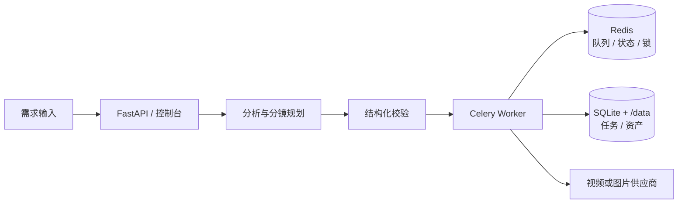

<div align="center">

# MultimodalCreativeAgent

### 多模态创作任务编排与短视频生产服务

[](02_Source/requirements-optional.txt)
[](https://github.com/baiqijun233/MultimodalCreativeAgent/actions/workflows/tests.yml)
[](02_Source/docker-compose.yml)
[](06_Tests)
[](LICENSE)

**需求输入 → 结构化分镜 → 异步执行 → 可追踪资产 → 成本可控交付**

</div>

MultimodalCreativeAgent 面向短剧、广告和内容团队的创作任务管理。系统将自然语言需求拆成角色、场景和分镜计划，经过结构化校验后进入异步任务队列，并保留阶段状态、失败重试和资产元数据。

<details>
<summary>快速导航</summary>

[项目预览](#项目预览) · [核心能力](#核心能力) · [运行架构](#运行架构) · [快速开始](#快速开始) · [配置与接口](#配置与接口) · [测试与验证](#测试与验证) · [路线图](#当前边界与路线图)

</details>

## 项目预览

<table>
  <tr>
    <td width="50%"><strong>桌面控制台</strong><br></td>
    <td width="50%"><strong>移动端控制台</strong><br></td>
  </tr>
</table>

截图来自本地运行的控制台，展示任务创建、状态查看和资产预览流程。

## 核心能力

| 模块 | 能力 |
| --- | --- |
| 创作规划 | 需求解析、角色/场景/分镜生成和结构化一致性校验 |
| 任务执行 | SQLite 状态、阶段检查点、有限重试、失败恢复和事件查询 |
| 异步处理 | Celery + Redis Worker，支持任务状态、跨进程锁和 WebSocket 事件 |
| 外部适配 | DeepSeek 规划、视频供应商、图片生成服务和可选对象存储接口 |
| 成本与安全 | 付费调用显式确认、额度审计、资产目录隔离和下载路径校验 |
| 运维入口 | FastAPI 控制台、健康/就绪检查、Prometheus 指标和 Docker Compose |

## 运行架构



## 快速开始

环境要求：Python 3.11+；容器运行需要 Docker Desktop 或 Docker Engine。

```powershell
docker compose -f 02_Source\docker-compose.yml up -d --build
```

访问控制台 <http://127.0.0.1:8001/>，健康检查为 <http://127.0.0.1:8001/health>，就绪检查为 <http://127.0.0.1:8001/ready>，指标接口为 <http://127.0.0.1:8001/metrics>。

没有外部模型密钥时可以使用离线模式：

```powershell
$env:MODEL_PROVIDER = "offline"
docker compose -f 02_Source\docker-compose.yml up -d
```

本机 Python 方式：

```powershell
Set-Location 02_Source
.\run_platform.ps1
```

## 配置与接口

密钥只通过环境变量注入，例如 `DEEPSEEK_API_KEY`、`ARTCLAW_API_KEY_ACCOUNT_A` 和 `IMAGE_API_KEY`。未配置外部模型时使用离线规划。所有可能产生费用的提交接口都要求显式确认。

| 方法 | 路径 | 作用 |
| --- | --- | --- |
| POST | `/tasks/async` | 创建异步创作任务 |
| GET | `/tasks/{task_id}` | 查看状态和分镜结果 |
| GET | `/tasks/{task_id}/events` | 查询阶段事件 |
| POST | `/tasks/{task_id}/artclaw-preview` | 预览视频提交内容 |
| POST | `/tasks/{task_id}/artclaw-submit` | 确认后提交视频任务 |
| POST | `/tasks/{task_id}/image-preview` | 预览图片资产计划 |
| POST | `/tasks/{task_id}/image-generate` | 确认后生成图片资产 |
| POST | `/tasks/{task_id}/artclaw-download` | 下载已完成视频 |
| GET | `/usage-audit` | 查看最小额度审计记录 |
| GET | `/metrics` | 输出基础指标 |

## 测试与验证

```powershell
python -m unittest discover -s 06_Tests -v
python -m compileall -q 02_Source 06_Tests
docker compose -f 02_Source\docker-compose.yml config
```

当前本地基线为 35 项测试通过，覆盖状态机、重试恢复、付费保护、资产路径、异步任务和接口注册。

## 项目结构

```text
02_Source/
├─ multimodal_creative_agent/  任务编排、存储和外部适配器
├─ run_platform.ps1            本机启动脚本
├─ run_docker.ps1              容器启动脚本
├─ Dockerfile                  容器构建文件
└─ docker-compose.yml          API、Worker 和 Redis
```

## 实现范围与第三方组件

维护者主导任务模型、状态机、接口、安全边界、测试和部署配置。DeepSeek、视频/图片供应商、Redis、Celery 和 FastAPI 作为可替换依赖，生产环境需按供应商协议配置凭证和网络访问。

## 当前边界与路线图

当前版本支持本机和单机容器验证，资产默认写入本地持久化目录。正式部署还需要服务器磁盘、对象存储、HTTPS、访问控制、监控告警和成本预算；后续将完善多人权限、媒体合成和更细粒度的配额策略。

## 贡献、许可证与安全

欢迎通过 Issue 或 Pull Request 参与。提交前请运行测试并移除密钥、运行数据和本机路径。本项目使用 [MIT License](LICENSE)，安全问题请按 [SECURITY.md](SECURITY.md) 联系维护者。
